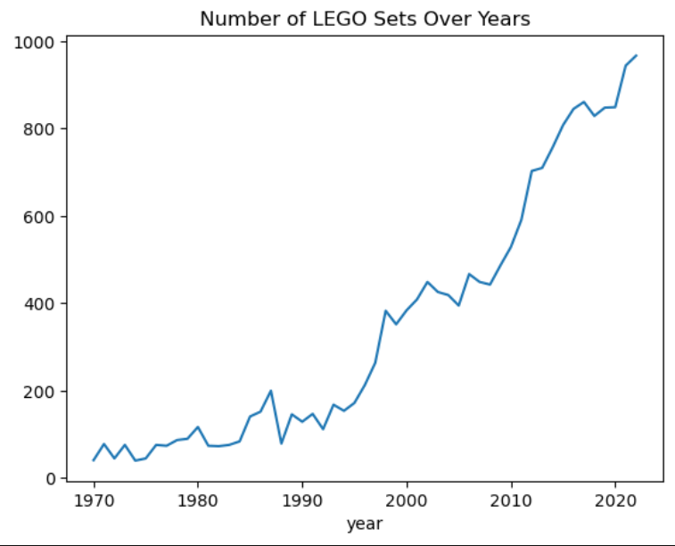
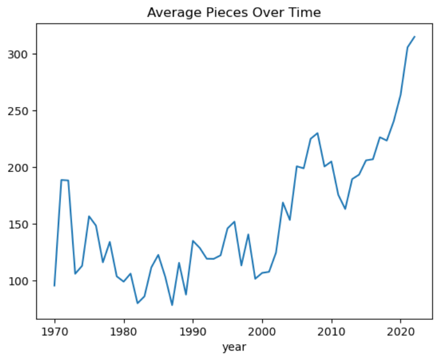
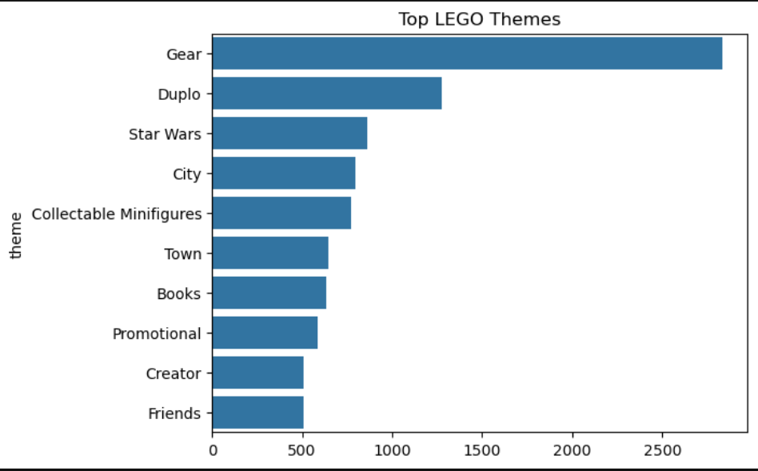

# LEGO-Sets-Analysis

**Problem Statement**
LEGO has evolved significantly over the years in terms of design complexity, pricing, and themes. However, there is limited understanding of how these factors have changed over time and what drives the pricing and popularity of LEGO sets.
This project aims to analyze LEGO datasets to uncover trends in production, complexity, and pricing, identify the most popular themes across decades, and explore the relationship between set features (such as number of pieces and minifigures) and their prices.

**PROJECT OBJECTIVE**
The objective of this project is to perform exploratory data analysis (EDA) and build a predictive model to:
Analyze growth trends of LEGO sets over time
Study the relationship between price and number of pieces
Identify the most popular LEGO themes across decades
Evaluate the role of minifigures in licensed sets
Predict LEGO set prices using machine learning

**Key Questions Answered**
1-How many LEGO sets have been released since 1970? Is there a trend?
2-Is there a relationship between price and number of pieces?
3-Which themes were most popular in each decade?
4-Are minifigures more common in licensed sets?
5-Can we predict LEGO set prices using features like pieces and minifigs?

**Dataset**
Source: Maven Analytics LEGO Dataset

**🧰 Technologies Used**
Python, Pandas, NumPy, Matplotlib, Seaborn, Scikit-learn

**Machine Learning**
- Model: Linear Regression
- Features: Pieces, Minifigs
- Target: Price
- Result: Model shows strong dependency of price on complexity

**Images**
LEGO Sets Over Time

Price vs Pieces

Top Themes

**Key Insights**
- LEGO production has increased significantly after 2000
- Strong positive relationship between price and number of pieces
- Certain themes dominate across decades
- Licensed sets tend to include more minifigures

** Conclusion**
LEGO sets have become more complex and expensive over time
Pricing is strongly influenced by pieces and minifigures
